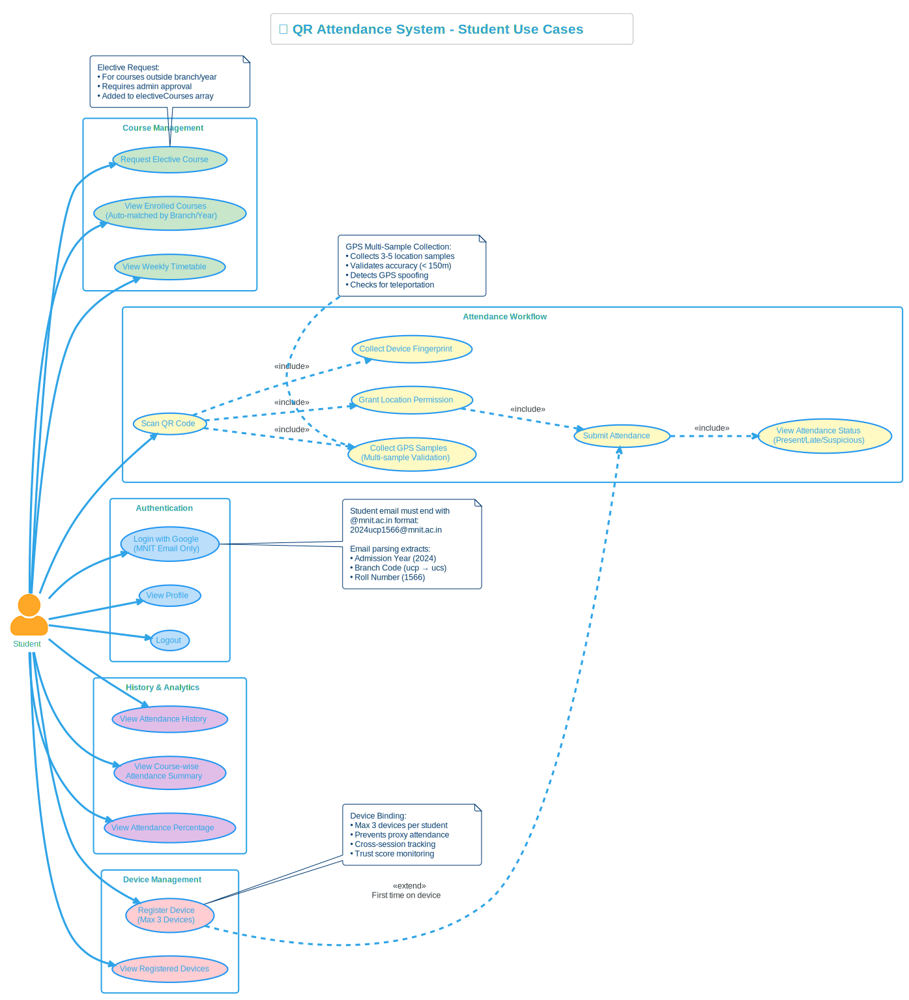

# 🎓 QR Attendance System v5.0

<div align="center">

### **A Secure, Intelligent, and Fraud-Proof Attendance Management System**

*Transforming how educational institutions track attendance through cutting-edge technology*

---

**🔐 7-Layer Security** • **📍 Adaptive GPS** • **📱 Device Binding** • **🔄 Rotating QR** • **📊 Real-time Analytics**

---

### 🌐 **[Live Demo](https://checkatte.vercel.app/)** | 🎬 **[Watch Demo Video](https://youtu.be/YOUR_VIDEO_ID)**

---

</div>

---

## 🚀 Quick Start for Evaluators

> **For hackathon judges/evaluators**: This section helps you quickly test the entire system.

### 📋 System Overview

```
┌────────────────────────────────────────────────────────────────────────────┐
│                         SYSTEM ARCHITECTURE                                 │
├────────────────────────────────────────────────────────────────────────────┤
│                                                                             │
│  ┌─────────────┐    ┌─────────────┐    ┌─────────────┐                     │
│  │   CLIENT    │    │   SERVER    │    │  DATABASE   │                     │
│  │  (React +   │◄──►│  (Node.js + │◄──►│  (MongoDB)  │                     │
│  │   Vite)     │    │   Express)  │    │             │                     │
│  └─────────────┘    └──────┬──────┘    └─────────────┘                     │
│                            │                                                │
│                     ┌──────▼──────┐                                        │
│                     │    REDIS    │ ← Session caching for performance      │
│                     │   (Cache)   │                                        │
│                     └─────────────┘                                        │
│                                                                             │
└────────────────────────────────────────────────────────────────────────────┘
```

### 🔑 Demo Credentials

| Role | Email | Password |
|------|-------|----------|
| **Admin** | `admin@classcheck.com` | `Admin@123` |
| **Professor** | Sign up with any email 
| **Student** | Sign up with your MNIT student email (e.g., `2024ucp1234@mnit.ac.in`)

### � Important: Use Mobile Phone for Session Creation

> ⚠️ **For Professors/Evaluators**: When starting an attendance session, please use a **mobile phone** instead of a laptop/PC.
> 
> **Why?** Laptops and PCs don't have GPS hardware—they use IP-based geolocation which is often **±1-10 kilometers** inaccurate. This causes students to fail location verification even when they're in the classroom.
>
> **Mobile phones have real GPS** hardware that provides accurate location (±5-50 meters), ensuring proper geo-fencing for attendance.
>
> *The app includes fallback options: GPS accuracy warnings and manual coordinate entry for desktop users.*

### �📖 Step-by-Step Usage Guide

#### Step 1️⃣: Admin Setup (Required First)

1. Go to **[https://checkatte.vercel.app/](https://checkatte.vercel.app/)**
2. Click **"Admin Login"**
3. Login with: `admin@classcheck.com` / `Admin@123`
4. **Add Courses**: Go to Courses → Bulk Import → Use sample JSON
5. **Approve Professors**: When professors sign up, approve them in the Approvals tab

#### Step 2️⃣: Professor Flow

1. **Sign Up** with an MNIT professor email
2. **Wait for Admin Approval** (or approve yourself as admin)
3. **Claim a Course**: Browse available courses → Request to claim
4. **Start a Session**:
   - Click "Start Session" button
   - Select course, set duration (10-180 mins)
   - Set GPS radius (20-500m) and QR rotation (15s-2min)
   - Allow location access → QR code appears

   > ⚠️ **IMPORTANT FOR EVALUATORS**: Use a **mobile phone** to start sessions! Laptops/PCs use IP-based geolocation which is inaccurate (often ±1-10km off). Mobile phones have real GPS hardware for precise location. The app will warn you if GPS accuracy is poor and allows manual coordinate entry as a fallback.

5. **Monitor Attendance**: View real-time student check-ins
6. **Stop Session**: Click "Stop Session" when done

#### Step 3️⃣: Student Flow

1. **Sign Up** with MNIT student email (format: `2024ucp1234@mnit.ac.in`)
2. **Login** to see your courses (auto-enrolled based on branch & year)
3. **Scan QR Code**: When professor starts session
   - Allow camera & location permissions
   - Point camera at QR code displayed by professor
4. **Attendance Marked**: If all 7 security checks pass ✅

### 🛡️ Security Layers Tested

When a student scans the QR code, these checks happen automatically:

| Layer | What it Checks | Fraud Prevented |
|-------|----------------|-----------------|
| 1 | **QR Token Validity** | Screenshot sharing |
| 2 | **QR Not Expired** | Old QR code reuse |
| 3 | **GPS Location** | Marking from hostel |
| 4 | **Device Fingerprint** | Phone sharing |
| 5 | **One Device/Student** | Multiple devices |
| 6 | **Session Active** | Post-class marking |
| 7 | **Academic Eligibility** | Wrong class attendance |

### 📁 Project Structure

```
├── client/                 # React Frontend (Vite)
│   ├── src/
│   │   ├── pages/          # Role-based pages
│   │   │   ├── admin/      # Admin dashboard, courses, users
│   │   │   ├── professor/  # Professor dashboard, sessions
│   │   │   └── student/    # Student dashboard, attendance
│   │   ├── components/     # Reusable UI components
│   │   └── context/        # Auth context
│   └── public/             # Static assets, PWA icons
│
├── server/                 # Node.js Backend (Express)
│   ├── controllers/        # Route handlers
│   │   ├── authController.js
│   │   ├── sessionController.js
│   │   ├── attendanceController.js
│   │   └── courseController.js
│   ├── models/             # MongoDB schemas
│   ├── middleware/         # Auth, rate limiting
│   ├── routes/             # API routes
│   ├── utils/              # Helpers (identity parser, etc.)
│   └── config/             # Redis, database config
│
├── readme/                 # README images
└── README.md               # This file
```

### 🔧 Tech Stack

| Component | Technology |
|-----------|------------|
| Frontend | React 18, Vite, CSS3 |
| Backend | Node.js, Express.js |
| Database | MongoDB Atlas |
| Cache | Redis (Upstash) |
| Hosting | Vercel (Frontend), Render (Backend) |
| Auth | JWT + Google OAuth |

---

## 📖 Table of Contents

1. [Problem Statement](#-problem-statement)
2. [Our Solution](#-our-solution)
3. [Key Innovations](#-key-innovations)
4. [System Workflow](#-system-workflow)
   - [Student Workflow](#-student-workflow)
   - [Professor Workflow](#-professor-workflow)
   - [Admin Workflow](#️-admin-workflow)
5. [Security Architecture](#-security-architecture)

---

## 🎯 Problem Statement

### The Challenge in Educational Institutions

Traditional attendance systems in colleges and universities face several critical problems:

| Problem | Impact |
|---------|--------|
| **Proxy Attendance** | Students mark attendance for absent friends |
| **No Location Verification** | Students mark from outside classroom |
| **Device Sharing** | One phone used to mark multiple students |
| **Easy to Manipulate** | QR codes can be shared via WhatsApp |
| **Manual Errors** | Roll calls are time-consuming and error-prone |

### Real-World Scenario

> *A student shares their phone with a friend. The friend scans the QR code from the hostel while the actual student is absent. Both get marked present. The professor has no way to detect this fraud.*

**This is exactly what our system prevents.**

---

## 💡 Our Solution

We've built a **multi-layer verification system** that makes proxy attendance virtually impossible:

```
┌─────────────────────────────────────────────────────────────────────────┐
│                        THE ATTENDANCE JOURNEY                            │
└─────────────────────────────────────────────────────────────────────────┘

    👨‍🏫 Professor                        👨‍🎓 Student
         │                                    │
         ▼                                    ▼
   ┌──────────┐                        ┌──────────────┐
   │  Start   │                        │  Open App &  │
   │ Session  │                        │  Scan QR     │
   └────┬─────┘                        └──────┬───────┘
        │                                     │
        ▼                                     ▼
   ┌──────────┐                        ┌──────────────┐
   │ Display  │◄─────  Student  ──────►│   Collect    │
   │ QR Code  │        Scans           │  GPS + Device│
   └────┬─────┘                        └──────┬───────┘
        │                                     │
        │         ┌─────────────┐             │
        │         │  7-LAYER    │             │
        └────────►│  SECURITY   │◄────────────┘
                  │   CHECK     │
                  └──────┬──────┘
                         │
                         ▼
                  ┌─────────────┐
                  │  ✅ PASS    │
                  │  Attendance │
                  │  Recorded   │
                  └─────────────┘
```

### What Makes Us Different?

| Traditional QR Systems | Our System |
|------------------------|------------|
| Static QR codes | **Rotating QR with HMAC tokens** (changes every 2 min) |
| No location check | **Adaptive GPS geo-fencing** (50-200m dynamic radius) |
| Any device can scan | **Device binding** (max 3 devices per student) |
| Single GPS reading | **Multi-sample GPS** (3-5 samples for accuracy) |
| No fraud detection | **7-layer security chain** with real-time validation |

---

## 🚀 Key Innovations

### 1. 🔐 Seven-Layer Security Chain

Every attendance request passes through **7 mandatory security checks**:

```
  Request ──► [1.Token] ──► [2.Rate] ──► [3.Replay] ──► [4.Academic] ──► [5.Device] ──► [6.Location] ──► [7.Duplicate] ──► ✅ Success
                │             │            │              │               │              │               │
                ▼             ▼            ▼              ▼               ▼              ▼               ▼
              ❌ Fail       ❌ Fail      ❌ Fail        ❌ Fail         ❌ Fail        ❌ Fail         ❌ Fail
```

| Layer | Security Check | What It Prevents |
|-------|----------------|------------------|
| 1 | **Token Validation** | Fake/tampered QR codes |
| 2 | **Rate Limiting** | Brute force attempts (max 10/hour) |
| 3 | **Replay Prevention** | Using same QR twice |
| 4 | **Academic Match** | Wrong course attendance |
| 5 | **Device Binding** | Shared device fraud |
| 6 | **Geo-fencing** | Remote attendance marking |
| 7 | **Duplicate Check** | Multiple markings |

---

### 2. 📍 Adaptive Geo-Fencing

Unlike fixed-radius systems, we **adapt to real-world GPS conditions**:

```javascript
// Our Adaptive Radius Formula
effectiveRadius = min(
    baseRadius + (GPS_accuracy × 1.5) × deviceFactor,
    maxRadius
)

// Device Factors
deviceFactor = {
    mobile:  1.0,   // Best GPS
    tablet:  1.2,   // Moderate GPS
    desktop: 1.5    // Poor GPS
}

// Example: Mobile with 30m GPS accuracy
// effectiveRadius = min(50 + (30 × 1.5) × 1.0, 200) = 95 meters
```

**Why this matters:** Indoor GPS can be unreliable. Instead of rejecting legitimate students, we adapt our threshold while still preventing remote fraud.

---

### 3. 📱 Multi-Sample GPS Collection

We collect **3-5 GPS samples** instead of trusting a single reading:

```
Sample 1 ──► Sample 2 ──► Sample 3 ──► Sample 4 ──► Sample 5
                            │
                            ▼
                   ┌─────────────────┐
                   │ Select BEST     │
                   │ Detect Spoofing │
                   └─────────────────┘
```

**Spoofing Detection:**
- Perfect accuracy (0m) = Suspicious
- Teleportation between samples = Rejected
- Missing altitude = Flagged

---

### 4. 🔄 HMAC-Signed Rotating QR Codes

Our QR codes are **cryptographically signed**:

```
QR Content: { session_id, hmac_token, nonce, timestamp, expiry }

Token = HMAC-SHA256(session_id + nonce + timestamp, SECRET_KEY)
```

**Security Properties:**
- ✅ Cannot be forged without server secret
- ✅ Expires in 2 minutes
- ✅ One-time use only
- ✅ Timing-safe comparison

---

### 5. 📱 Device Trust System

Each student can register **max 3 devices** with trust scoring:

```
Trust Score: 100 → 80 → 60 → 40 → 20 → 🚫 BLOCKED
                ↓      ↓      ↓      ↓
           Suspicious activity detected at each step
```

**Cross-session detection:** If a device is registered to Student A, Student B cannot use it.

---

### 6. 🎓 Automatic Course Enrollment

Students are **auto-enrolled** based on email parsing:

```
Email: 2024ucp1566@mnit.ac.in
         │   │  │
         │   │  └── Roll Number: 1566
         │   └───── Branch: UCS (Computer Science)
         └───────── Admission Year: 2024

→ Auto-calculate: 1st Year, 1st Semester
→ Auto-enroll in: All UCS Year-1 courses
```

---

## 🔄 System Workflow

The system has **three user roles** with distinct workflows. Below are detailed explanations with use case diagrams.

---

## 👨‍🎓 Student Workflow

<p align="center">
  
</p>

### Complete Student Journey

---

#### **Step 1: Login with Google (MNIT Email)**

```
1. Open the app → Click "Login with Google"
2. Select MNIT email (e.g., 2024ucp1566@mnit.ac.in)
3. System extracts:
   ├── Admission Year: 2024
   ├── Branch: UCS
   └── Roll Number: 1566
4. Redirected to Student Dashboard
```

**Why MNIT email only?** Ensures only legitimate students access the system.

---

#### **Step 2: View Auto-Enrolled Courses**

```
Dashboard shows courses matched by:
├── Student's Branch (e.g., UCS)
└── Student's Current Year (calculated from admission year)

Additional options:
├── View weekly timetable
└── Request elective courses (admin approval needed)
```

---

#### **Step 3: Mark Attendance (Core Flow)**

**This is the most important workflow:**

```
Professor displays QR code
        ↓
Student opens "Scan QR" page
        ↓
Grant location permission (first time)
        ↓
Scan QR code with camera
        ↓
App collects:
├── QR data (session, token, nonce, timestamp)
├── GPS samples (3-5 readings)
└── Device fingerprint
        ↓
Submit to server
        ↓
7-Layer Security Validation
        ↓
✅ Success! Shows:
├── Course Name
├── Status (PRESENT / LATE)
├── Timestamp
└── Distance from classroom
```

---

#### **Step 4: View Attendance History**

```
📊 Overall Summary:
├── Total Sessions: 60
├── Present: 50 | Late: 8 | Absent: 2
└── Attendance: 96.7%

📚 Course-wise:
├── Data Structures: 85%
├── DBMS: 90%
└── Networks: 75%
```

---

#### **Step 5: Device Management**

```
📱 My Devices (Max 3):
├── iPhone 13 - Active, Trust: 100
├── Samsung Galaxy - Active, Trust: 85
└── [Empty Slot]

Devices auto-register on first use.
```

---

## 👨‍🏫 Professor Workflow

<p align="center">
  
</p>

### Complete Professor Journey

---

#### **Step 1: Login & Approval**

```
1. Go to Professor Login
2. Login with any Google account
3. First-time: Status = "Pending Approval"
4. Admin reviews and approves
5. Full access granted
```

**Why approval needed?** Prevents unauthorized session creation.

---

#### **Step 2: Claim Courses**

```
1. Browse all courses created by admin
2. Click "Claim" on your courses
3. Wait for admin approval
4. Approved courses appear in "My Courses"
```

---

#### **Step 3: Start Attendance Session**

```
1. Select a claimed course
2. Click "Start Session"
3. Configure (optional):
   ├── Duration: 60 minutes
   ├── Location: Auto-detected or manual
   ├── Radius: 50m
   └── Late Threshold: 15 minutes
4. QR code appears immediately!
```

---

#### **Step 4: Display QR & Monitor Live**

```
┌─────────────────────────────────────────┐
│          📊 LIVE SESSION                 │
├─────────────────────────────────────────┤
│      ┌─────────────────────┐            │
│      │     QR CODE         │            │
│      │   (Rotates every    │            │
│      │    2 minutes)       │            │
│      └─────────────────────┘            │
│                                          │
│  ⏱️ Time Remaining: 45:23                │
│  👥 Attendance: 45/60 students           │
│                                          │
│  Recent:                                 │
│  • Rahul - PRESENT - 2 sec ago          │
│  • Priya - LATE - 30 sec ago            │
│                                          │
│  [🔄 Refresh QR]  [⏹️ Stop Session]       │
└─────────────────────────────────────────┘
```

---

#### **Step 5: End Session & Export**

```
1. Click "Stop Session"
2. View summary:
   ├── Present: 45
   ├── Late: 10
   └── Absent: 5
3. Export to CSV for records
```

---

## 🛡️ Admin Workflow

<p align="center">
  
</p>

### Complete Admin Journey

---

#### **Step 1: Login (Credential-Based)**

```
1. Go to /admin/login
2. Enter email & password (from server .env)
3. Access Admin Dashboard
```

---

#### **Step 2: Dashboard Overview**

```
┌─────────────────────────────────────────────────────────────┐
│                    🛡️ ADMIN DASHBOARD                        │
├─────────────────────────────────────────────────────────────┤
│  📊 Statistics                                               │
│  ├── Students: 1,250  │  Professors: 45                     │
│  ├── Courses: 120     │  Active Sessions: 15                │
│                                                              │
│  ⚠️ Pending Actions                                          │
│  ├── Professor Approvals: 3                                  │
│  ├── Course Claims: 5                                        │
│  └── Elective Requests: 8                                    │
│                                                              │
│  🚨 Security Alerts                                          │
│  ├── Device blocked: student123 (2 min ago)                 │
│  └── GPS spoof detected: student456 (1 hr ago)              │
└─────────────────────────────────────────────────────────────┘
```

---

#### **Step 3: User Management**

```
PROFESSORS:
├── View pending → Approve/Reject
└── View all approved professors

STUDENTS:
├── Search by branch/year
├── Handle non-standard emails
└── Bulk approve
```

---

#### **Step 4: Course Management**

```
CREATE COURSE:
├── Course Code & Name
├── Branch, Year, Semester
├── Schedule (Day, Time, Room)
└── Default geo-fence location

BULK IMPORT:
└── Upload JSON timetable → Creates all courses at once
```

---

#### **Step 5: Request Processing**

```
CLAIM REQUESTS (Professor → Course):
├── Professor wants to teach CS101
└── Approve/Reject

ELECTIVE REQUESTS (Student → Course):
├── Student wants to take ECE elective
└── Approve/Reject
```

---

#### **Step 6: Security Monitoring**

```
VIEW:
├── Suspicious attendance records
├── Flagged devices
├── Security event logs
└── Complete audit trail (90 days)
```

---

## 🔒 Security Architecture

### The Complete 7-Layer Security Chain

```
┌─────────────────────────────────────────────────────────────────────────────┐
│ LAYER 1: TOKEN VALIDATION                                                    │
│ • Is session active?                                                         │
│ • Is token not expired? (2 min + 10s grace)                                 │
│ • Does HMAC signature match?                                                 │
│                            │ PASS                    │ FAIL                  │
│                            ▼                         ▼                       │
│                      Continue              ❌ "Invalid or expired QR"        │
└─────────────────────────────────────────────────────────────────────────────┘
                                      │
                                      ▼
┌─────────────────────────────────────────────────────────────────────────────┐
│ LAYER 2: RATE LIMIT                                                          │
│ • Has student exceeded 10 attempts/hour?                                     │
│                            │ PASS                    │ FAIL                  │
│                            ▼                         ▼                       │
│                      Continue              ❌ "Too many attempts"            │
└─────────────────────────────────────────────────────────────────────────────┘
                                      │
                                      ▼
┌─────────────────────────────────────────────────────────────────────────────┐
│ LAYER 3: REPLAY PREVENTION                                                   │
│ • Has this token+nonce been used before?                                     │
│                            │ PASS                    │ FAIL                  │
│                            ▼                         ▼                       │
│                      Continue              ❌ "QR already used"              │
└─────────────────────────────────────────────────────────────────────────────┘
                                      │
                                      ▼
┌─────────────────────────────────────────────────────────────────────────────┐
│ LAYER 4: ACADEMIC VALIDATION                                                 │
│ • Does student's branch/year match course?                                   │
│ • OR is course in approved electives?                                        │
│                            │ PASS                    │ FAIL                  │
│                            ▼                         ▼                       │
│                      Continue              ❌ "Not enrolled"                 │
└─────────────────────────────────────────────────────────────────────────────┘
                                      │
                                      ▼
┌─────────────────────────────────────────────────────────────────────────────┐
│ LAYER 5: DEVICE VALIDATION                                                   │
│ • Is device registered to student? (max 3 devices)                          │
│ • Is device shared with another student?                                     │
│ • Is device blocked?                                                         │
│                            │ PASS                    │ FAIL                  │
│                            ▼                         ▼                       │
│                      Continue              ❌ "Device issue"                 │
└─────────────────────────────────────────────────────────────────────────────┘
                                      │
                                      ▼
┌─────────────────────────────────────────────────────────────────────────────┐
│ LAYER 6: LOCATION VALIDATION                                                 │
│ • Calculate distance from classroom center                                   │
│ • Apply adaptive radius formula                                              │
│ • Detect GPS spoofing (perfect accuracy, teleportation)                     │
│                            │ PASS                    │ FAIL                  │
│                            ▼                         ▼                       │
│                      Continue              ❌ "Outside zone"                 │
└─────────────────────────────────────────────────────────────────────────────┘
                                      │
                                      ▼
┌─────────────────────────────────────────────────────────────────────────────┐
│ LAYER 7: DUPLICATE CHECK                                                     │
│ • Already marked for this session?                                           │
│ • Device already used in this session?                                       │
│                            │ PASS                    │ FAIL                  │
│                            ▼                         ▼                       │
│                      Continue              ❌ "Already marked"               │
└─────────────────────────────────────────────────────────────────────────────┘
                                      │
                                      ▼
┌─────────────────────────────────────────────────────────────────────────────┐
│                         ✅ ALL CHECKS PASSED!                                │
│  • Status: PRESENT (≤15 min) or LATE (>15 min)                              │
│  • Attendance recorded with full audit trail                                 │
└─────────────────────────────────────────────────────────────────────────────┘
```

---

## 🎯 Summary

### What We Built

| Feature | Implementation |
|---------|----------------|
| **Proxy Prevention** | 7-layer security chain |
| **Location Verification** | Adaptive geo-fencing (50-200m) |
| **Device Control** | Max 3 devices with trust scoring |
| **QR Security** | HMAC-signed, rotating every 2 min |
| **GPS Accuracy** | Multi-sample collection, spoof detection |
| **Auto Enrollment** | Email parsing for branch/year |
| **Audit Trail** | Complete logs for 90 days |

### Key Innovations

| Innovation | Benefit |
|------------|---------|
| **Adaptive Geo-fencing** | Works reliably indoors with poor GPS |
| **Multi-sample GPS** | Catches GPS spoofing apps |
| **HMAC Rotating QR** | Prevents QR sharing via WhatsApp |
| **Device Trust System** | Tracks and blocks suspicious devices |
| **7-Layer Security** | Defense in depth - if one fails, others catch |

---

<div align="center">

## 👨‍💻 Built By

**Rishi Kataria**
**Ritesh Kumar**

---

### 🔐 Making Attendance Secure, Simple, and Smart

*Thank you for reviewing our project!*

</div>
