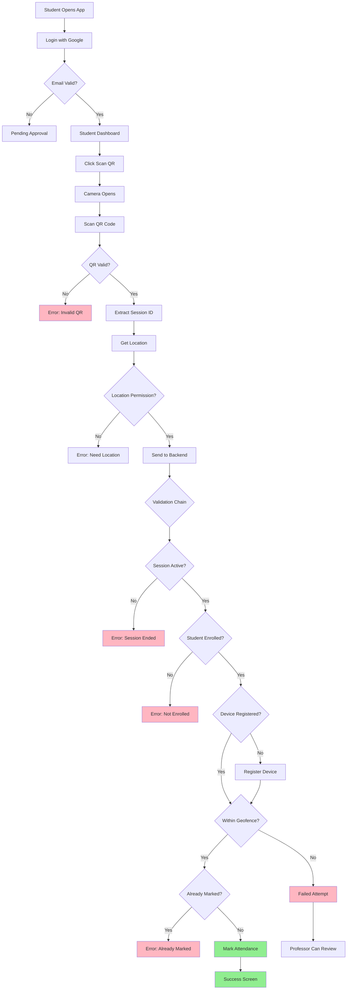
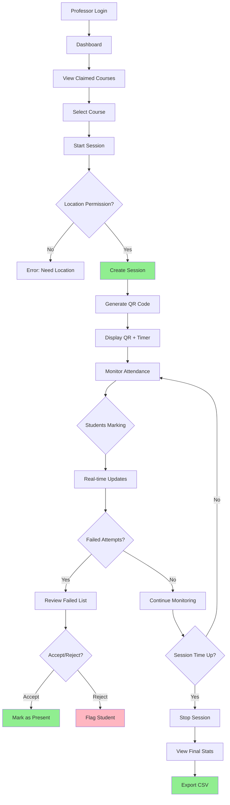
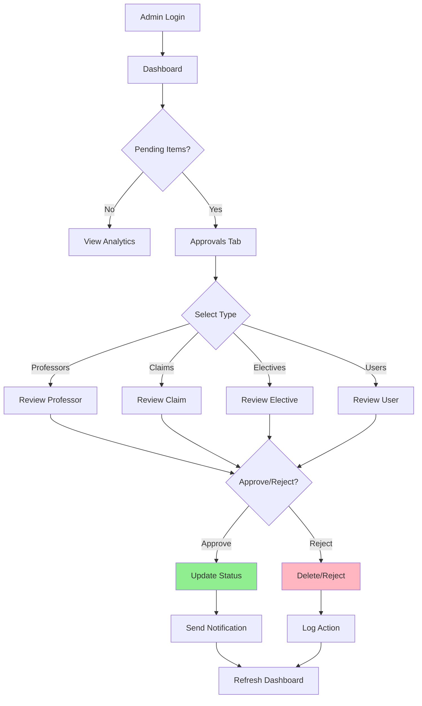
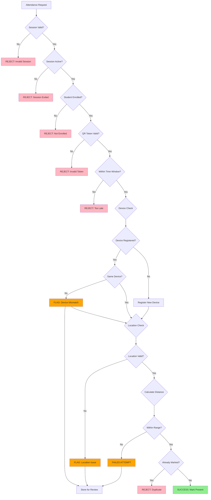
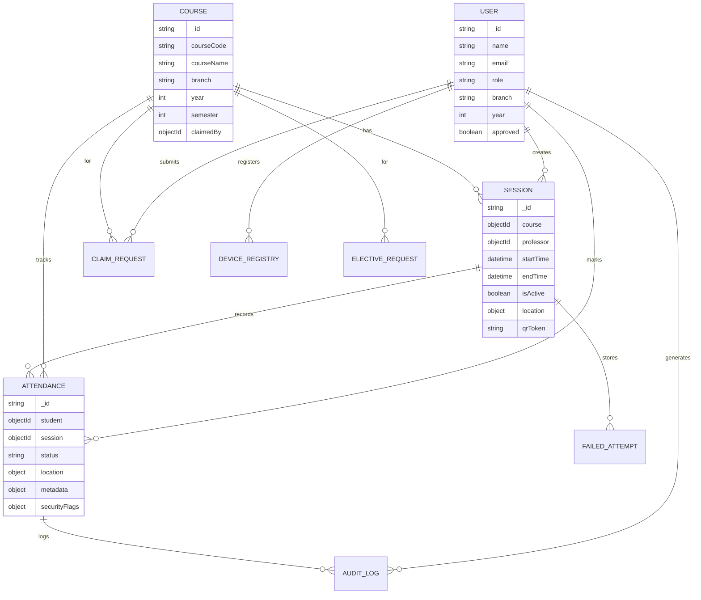
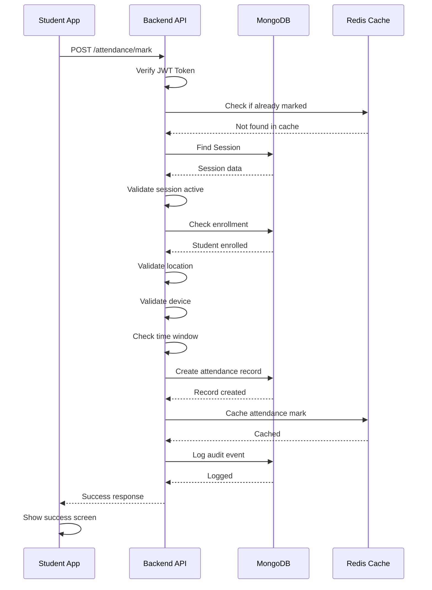
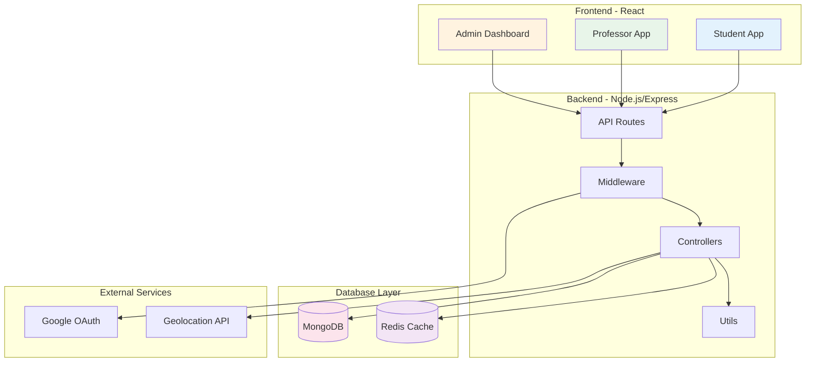
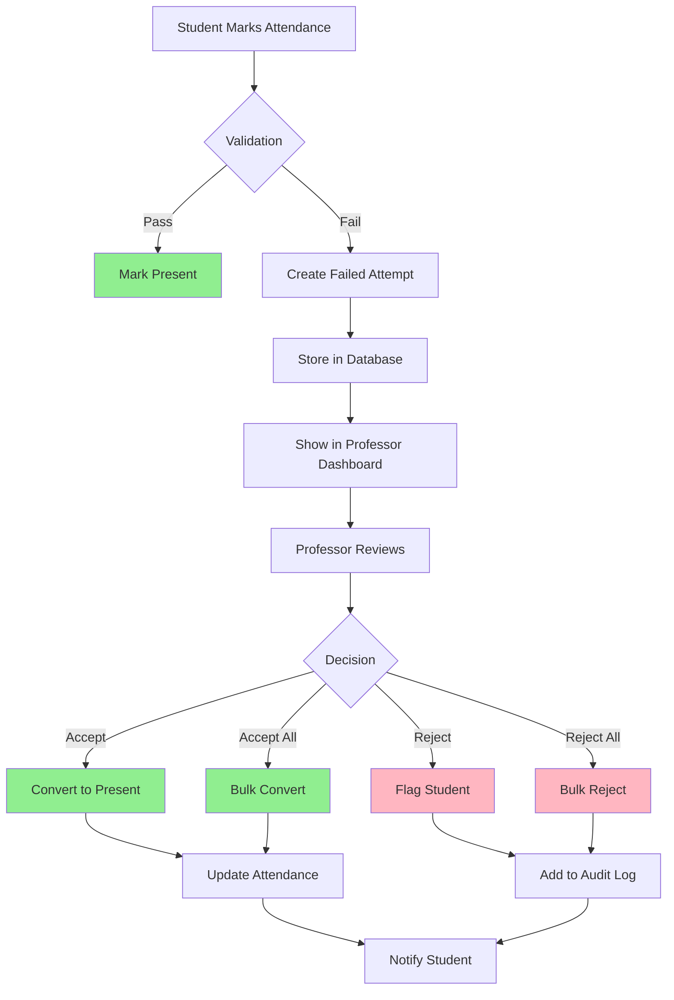
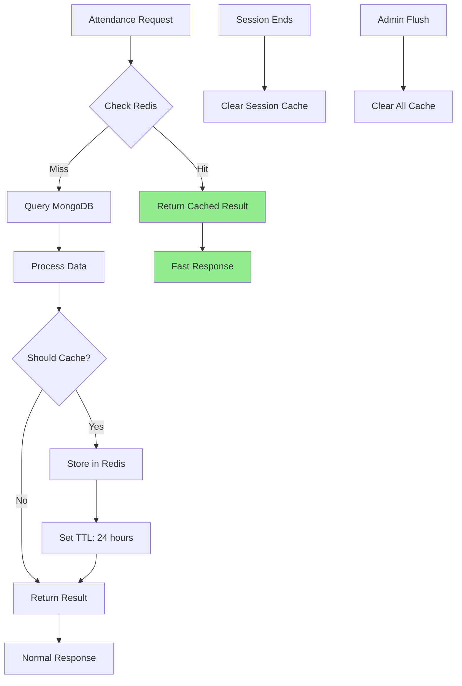
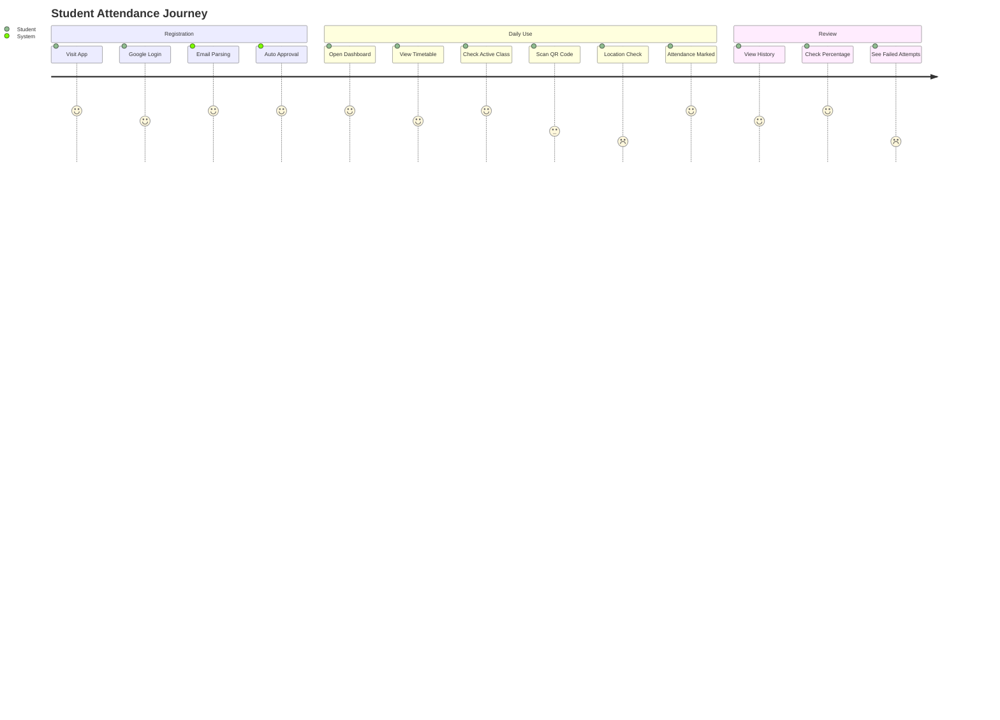

# QR Attendance System - Flow Diagrams

## How to View These Diagrams:
1. Copy the code blocks below
2. Go to https://mermaid.live/
3. Paste the code
4. View/Export the diagram

---

## 1. Student Attendance Flow



---

## 2. Professor Session Management Flow



---

## 3. Admin Approval Workflow



---

## 4. Security Validation Chain



---

## 5. Database Schema Relationships



---

## 6. API Request Flow



---

## 7. System Architecture



---

## 8. Failed Attempt Review Flow



---

## 9. Redis Caching Strategy



---

## 10. Complete User Journey Map



---

## How to Use These Diagrams:

### Method 1: Mermaid Live Editor
1. Go to https://mermaid.live/
2. Copy any diagram code above
3. Paste in the editor
4. Download as PNG/SVG

### Method 2: VS Code Extension
1. Install "Markdown Preview Mermaid Support"
2. Open this file in VS Code
3. Preview with Ctrl+Shift+V

### Method 3: GitHub
- GitHub automatically renders Mermaid diagrams in markdown files

---

## Additional Tools:

### For Code Analysis:
- **Madge**: Generate dependency graphs
  ```bash
  npm install -g madge
  madge --image graph.png client/src
  ```

### For Architecture:
- **Draw.io**: https://app.diagrams.net/
- **Lucidchart**: https://www.lucidchart.com/

### For API Documentation:
- **Swagger**: Auto-generate API docs
- **Postman**: Generate flow diagrams from collections

---

**Created:** January 9, 2026
**Format:** Mermaid Diagrams
**Compatible with:** GitHub, VS Code, Mermaid Live Editor
